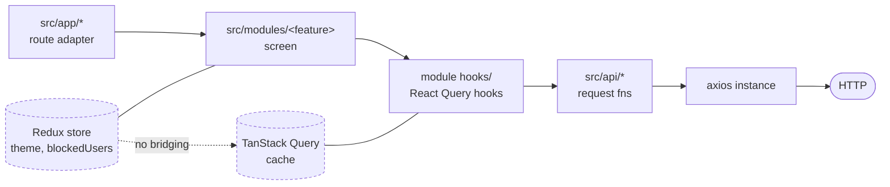

# respond-chat

A React Native chat client built on Expo SDK 57 with `expo-router`. Two tabs: a paginated conversation list, and a message thread with infinite scroll and optimistic send. Plus a profile screen with local block/unblock, and a light/dark toggle in settings.

Two things to know before you read any code:

- **No auth, no current user.** Every route is public. The profile card in settings is a hardcoded object in [SettingsTab.tsx](src/modules/settings/tab/SettingsTab.tsx).
- **The backend is external.** This repo is the client only. See [Backend contract](#backend-contract) for what the API has to serve.

## Quickstart

Node 22 (matches CI). Note that [.npmrc](.npmrc) sets `legacy-peer-deps=true` — `nativewind@5` is a preview release with unsatisfiable peers, so `npm install` needs it.

```bash
npm install
```

Create `.env.local` (gitignored, and there is no `.env.example` — this block is it):

```
EXPO_PUBLIC_API_URL=https://your-api.example.com
```

**Expo Go will not work** — `react-native-keyboard-controller` is a third-party native module and isn't bundled in it. You need a development build. There's no committed `ios/` or `android/` directory, so the first run prebuilds:

```bash
npx expo run:ios          # or: npx expo run:android
```

After that, the dev server alone is enough:

```bash
npm start                 # or: npm run ios / npm run android
```

## Stack

| Role | What |
| --- | --- |
| Framework | Expo SDK 57, React Native 0.86, React 19 |
| Routing | `expo-router`, file-based — typed routes and React Compiler both on |
| Styling | NativeWind v5 (preview) + Tailwind v4 |
| Components | gluestack-ui v5, vendored into the repo |
| Server state | TanStack Query v5 |
| Client state | Redux Toolkit — one slice |
| HTTP | axios |
| Testing | Jest + `jest-expo/ios` + React Native Testing Library 14 |

Exact versions live in [package.json](package.json). Two facts that change how you write code here:

- **Tailwind v4 is CSS-first — there is no `tailwind.config.js`.** Design tokens are an `@theme inline` block in [src/global.css](src/global.css).
- **gluestack-ui is vendored source under [src/components/ui/](src/components/ui/), not a dependency.** Edit it in place.

Expo changed a lot in recent SDKs. Pin doc reads to <https://docs.expo.dev/versions/v57.0.0/> — see [AGENTS.md](AGENTS.md).

## Project structure

```
src/
├── app/                          # expo-router routes — no business logic
│   ├── _layout.tsx               # provider stack + root Stack
│   ├── (tabs)/
│   │   ├── _layout.tsx           # 2-tab bottom bar
│   │   ├── index.tsx             # chats tab (default route)
│   │   └── settings.tsx
│   └── chat/
│       ├── conversation-detail/[userId].tsx
│       └── profile/[userId].tsx
├── modules/                      # feature code — the real screens
│   ├── app/appSlice.ts           # the only redux slice
│   ├── chat/
│   │   ├── hooks/useUser.ts      # shared across chat areas
│   │   ├── conversation-detail/  # ← exemplar, expanded below
│   │   │   ├── ConversationDetailScreen.tsx
│   │   │   ├── index.ts          # barrel
│   │   │   ├── constants.ts      # module-local layout numbers
│   │   │   ├── components/       # BubbleMessage, ChatComposer, …
│   │   │   │   ├── index.ts
│   │   │   │   └── __tests__/
│   │   │   └── hooks/            # usePostsByUserId, useCreatePost, …
│   │   │       └── __tests__/
│   │   ├── tab/                  # conversation list
│   │   └── profile/              # profile + block/unblock
│   └── settings/tab/             # theme toggle, app version
├── api/                          # transport only
│   ├── axios.ts                  # the axios instance
│   ├── common.ts                 # pagination envelope
│   ├── posts/index.ts
│   └── users/{index.ts,mapper.ts}
├── components/
│   ├── layouts/ScreenContainer.tsx
│   ├── animated-icon.tsx         # AnimatedSplashOverlay
│   └── ui/                       # ~60 vendored gluestack primitives —
│                                 #   treat as generated. chat-ai/ and
│                                 #   bottomsheet/ are dead code, excluded
│                                 #   from Jest, slated for deletion
├── constants/theme.ts            # raw hex for nav headers only
├── store/index.ts                # configureStore
├── types/                        # plain type aliases
├── utils/                        # formatTimestamp, id helpers
├── test-utils/index.tsx          # renderWithProviders & friends
└── global.css                    # Tailwind v4 entry + design tokens

app-config/assets/                # app icons, splash, favicon (non-default)
app.json  babel.config.js  metro.config.js  postcss.config.mjs
jest.config.js  jest.setup.ts  tsconfig.json  eslint.config.js
```

Reading the tree:

- `src/app` is **routes only** — file-based paths, layouts, and param parsing.
- `src/modules/<feature>/<area>` is where screens actually live.
- `src/api` is transport: request functions and nothing else.
- `src/types`, `src/utils`, `src/constants` are shared leaves — imported by anything, importing nothing.

## Architecture

### Layers and dependency direction



Flow is one-way: a route file renders a module screen, the screen calls hooks from its own `hooks/` directory, those hooks call functions in `src/api`. **`src/api` never imports React Query** — it returns plain promises, which is what makes it testable with a mocked axios and reusable outside a component.

Every module area has the same shape:

```
<area>/
  <Name>Screen.tsx     # or <Name>Tab.tsx — the screen
  index.ts             # barrel: export { default as XScreen } from './XScreen'
  components/          # leaf components + their index.ts barrel
  hooks/               # React Query wrappers, navigation side effects
  constants.ts         # module-local layout numbers
  __tests__/           # colocated, inside components/ and hooks/
```

[src/modules/chat/conversation-detail/](src/modules/chat/conversation-detail/) is the worked example. Route files carry **no business logic — params only**; the most they do is `Number(params.userId)`, see [\[userId\].tsx](src/app/chat/profile/[userId].tsx). Module areas expose a barrel `index.ts` that routes import from.

### State: two stores, no bridge

- **Redux holds only client UI state** — `theme` and `blockedUsers` — in a single slice, [appSlice.ts](src/modules/app/appSlice.ts), wired up in [src/store/index.ts](src/store/index.ts).
- **TanStack Query holds all server data.** Nothing server-derived is ever copied into Redux.
- **Nothing bridges the two.** No selectors reading the query cache, no middleware syncing the other way.

Two consequences worth knowing up front: there's **no persistence**, so the theme resets on a cold start; and there are **no typed `useAppSelector` / `useAppDispatch` wrappers** — call sites annotate inline, `useSelector((state: RootState) => state.app)`.

Query keys are inline array literals — `['users', { limit }]`, `['posts', { userId }]`, `['user', id]`. There is **no key factory**; don't go looking for one.

Blocking is local-only: a blocked user stays in the list and stays openable, just labelled.

### Routing

| Route | File | Module |
| --- | --- | --- |
| `/(tabs)` | [index.tsx](<src/app/(tabs)/index.tsx>) | `modules/chat/tab` |
| `/(tabs)/settings` | [settings.tsx](<src/app/(tabs)/settings.tsx>) | `modules/settings/tab` |
| `/chat/conversation-detail/[userId]` | [\[userId\].tsx](src/app/chat/conversation-detail/[userId].tsx) | `modules/chat/conversation-detail` |
| `/chat/profile/[userId]` | [\[userId\].tsx](src/app/chat/profile/[userId].tsx) | `modules/chat/profile` |

Both detail screens are **pushed on the root stack** with native headers — there are no modal presentations.

The provider stack in [_layout.tsx](src/app/_layout.tsx), outermost first:

```
Provider (redux)
└── QueryClientProvider
    └── KeyboardProvider
        └── GluestackUIProvider  mode={theme}   ← reads redux
            └── ThemeProvider (expo-router)
                ├── AnimatedSplashOverlay
                └── Stack
```

[src/test-utils/index.tsx](src/test-utils/index.tsx) deliberately mirrors this stack minus `KeyboardProvider` and expo-router's `ThemeProvider`, plus a `SafeAreaProvider`. If you add a provider here, add it there.

### Styling and theming

The theme chain is the least obvious mechanism in the repo:

```
redux app.theme → GluestackUIProvider calls Appearance.setColorScheme(mode)
  → NativeWind resolves @media (prefers-color-scheme: dark) in global.css
  → CSS variables swap
```

It is **not** a `.dark` class toggle on native. The `:root.dark` / `:root.light` blocks in [global.css](src/global.css) only do anything on web.

Two rules:

- **Style with Tailwind token classes** sourced from `global.css` — `bg-background`, `text-foreground`, `text-muted-foreground`, `border-border`. Reach for `StyleSheet.create` only for what Tailwind can't express (absolute positioning, min/max heights, gradients).
- **`Colors` in [constants/theme.ts](src/constants/theme.ts) exists only for `Stack` / `Tabs` options that need a raw hex string** — two call sites, both layouts. Its dark values are stale. Don't reach for it in components, and don't extend it.

One deliberate choice, already commented in `global.css`: `--primary-foreground` is near-black because white on the brand amber is ~2:1 and fails WCAG, while dark-on-amber is ~8.7:1. Don't "fix" it to white.

## Adding a feature

1. Request function in `src/api/<resource>/index.ts` — plain `async`, returns `response.data`. No React Query.
2. Types in `src/types/`.
3. Module directory at `src/modules/<feature>/<area>/`, following the shape above.
4. React Query hook in that module's `hooks/` — the query key is an inline array.
5. Thin route file in `src/app/` that renders the screen and passes params.
6. Colocated test in `__tests__/`.

[chat/conversation-detail](src/modules/chat/conversation-detail/) does all six; copy it.

## Backend contract

Endpoints consumed:

- `GET /users` — paginated
- `GET /users/:id`
- `GET /posts?userId&limit&offset` — paginated
- `POST /posts`

Paginated responses use one offset/limit envelope, from [src/api/common.ts](src/api/common.ts):

```ts
interface IPaginationResponse<T> {
  total: number;
  limit: number;
  offset: number;
  results: T[];
}
```

**There is no conversation resource on the backend.** [users/mapper.ts](src/api/users/mapper.ts) projects each `User` into a `Conversation` and fabricates the preview fields — `lastMessage: 'hello world'` and a `new Date()` timestamp. That's why every row in the list shows the same message. Messages themselves are posts: a thread is `GET /posts?userId=…` sorted newest-first into an inverted list.

Sends go through [useCreatePost.ts](src/modules/chat/conversation-detail/hooks/useCreatePost.ts), which posts the body and optimistically prepends a row keyed by an `expo-crypto` `tempId` with a negative placeholder `id` (`generateUniqueNegativeNumber()` in [src/utils/](src/utils/index.ts)) — reconciling on success by matching `tempId`, rolling back on error.

## Testing

```bash
npm test              # run once
npm run test:watch
npm run test:coverage
npm run test:ci       # what CI runs
```

Tests are colocated in `__tests__/` next to their subject. Three rules that catch everyone in the first hour:

- **`await` everything from RNTL 14** — `render`, `fireEvent`, `rerender`, `unmount` all return promises. A missing `await` surfaces as a confusing "`render` function has not been called".
- **Use `renderWithProviders` / `renderHookWithProviders`** from `@/test-utils` for anything touching Redux, React Query or safe-area insets.
- **Never assert on Tailwind classes.** Jest doesn't run Metro's CSS pipeline, so `className` resolves to no styles and `toHaveStyle()` fails. Assert on text, a11y labels, testIDs, behaviour.

[docs/testing.md](docs/testing.md) is the reference — preset choice, `transformIgnorePatterns` rationale, and every gotcha.

## Configuration

**The `@/*` → `./src/*` alias is declared in three places that must stay in sync.** Change one, change all three:

| File | Where |
| --- | --- |
| [tsconfig.json](tsconfig.json) | `compilerOptions.paths` |
| [babel.config.js](babel.config.js) | `module-resolver` plugin `alias` |
| [jest.config.js](jest.config.js) | `moduleNameMapper` |

The rest, one line each:

- [babel.config.js](babel.config.js) — `babel-preset-expo` + `nativewind/babel` (pinned via `require.resolve`, so Jest doesn't pull the ESM build), `module-resolver`, and `react-native-worklets/plugin`, which must stay last. Reanimated 4 needs the worklets plugin, not `react-native-reanimated/plugin`.
- [metro.config.js](metro.config.js) — wraps the default config in `withNativewind`.
- [postcss.config.mjs](postcss.config.mjs) — `@tailwindcss/postcss` (Tailwind v4; no `autoprefixer` pair).
- [app.json](app.json) — scheme `respondchat`; icons and splash live in the non-default [app-config/assets/](app-config/assets/); `typedRoutes` and `reactCompiler` experiments on. No `ios.bundleIdentifier` / `android.package` set yet.
- [package.json](package.json) — `lightningcss` is pinned in both `overrides` and `resolutions`. Don't bump it casually.

## CI

[.github/workflows/test.yml](.github/workflows/test.yml), Node 22, on push to `main` and on every PR. Lint and `tsc --noEmit` are **currently non-blocking** (`continue-on-error`) while a pre-existing backlog is cleared; `npm run test:ci` is the only gate. So the wall of lint and type output on your first run probably isn't yours — the workflow file tracks the counts and flips to blocking once they hit zero.

## Also in this repo

- [AGENTS.md](AGENTS.md) — instructions for coding agents ([CLAUDE.md](CLAUDE.md) is a one-line include of it).
- [docs/testing.md](docs/testing.md) — the testing reference.
- [LICENSE](LICENSE) — MIT.
